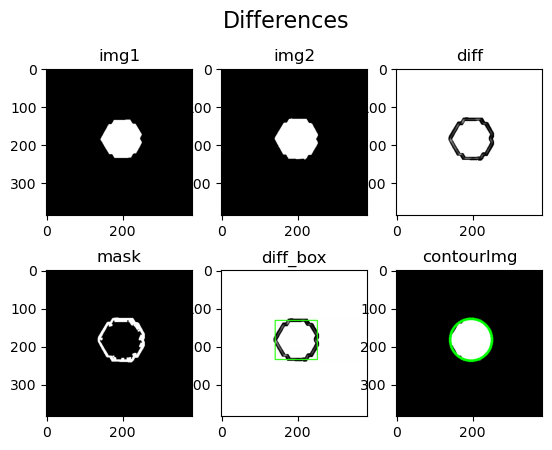
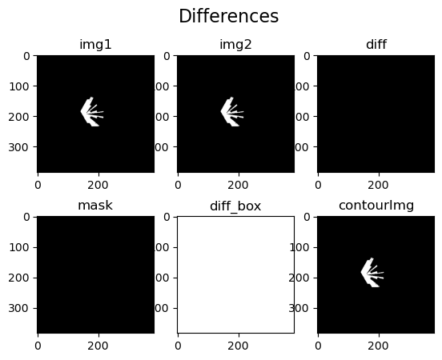

`TurtleBot3Burger Docs`: https://emanual.robotis.com/docs/en/platform/turtlebot3/features/
`TurtleBot3Burger ROS`: https://robots.ros.org/turtlebot3/

Secure bot

The goal is to have a robot that is smart enough to detect if there's anything out of the ordinary in the house (in case nobody's home and don't have pets) and dumb enough for me to implement.

- Movement

  - MoveRandomly: Using Lidar, check for wall and rotate the bot to the clearest path to avoid collision (via cmd_vel-velocity commands)
  - Routing: Draw the household/platform layout mannually at first (named map.pgm) using turtlebot3's node, this map then be used for autonomous routing later.
    - Autonomous routing:
      Approaches:
      - let it goes randomly and occasionaly check if the new map is finished (by compare the mask of the current map to the original's mask. If the 2 mask are similar, then the patrol route could be considered as finished. 
          
        However this leads to 2 big issues: - It could take the bot forever to finish the route because of the random nature of this patrolling method - The robot could just go around the edge of the map without checking the center and this method still think it's finished.
      - Next approach: Draw a fixed path for the robot to follow.

- Detect anomaly

  - After redraw map 2nd time, compare it to the first image. If an anomaly is detected, return true, otherwise return false. this will be used to create an API for the web application for the end users. 
      

- `Developing problems`:
  - Here, for some reason the 2 map have different sizes, (therefor I used SIMM to get the similarity) 
  - The listener node doesnt always listen, sometime the callback doesn't happen. I'll address this in the next few days.
  - Currently I encounter some problems with RVIZ, the robot seem to not be able to navigate for some reasons.
- After all of the above is done, the next goal of the project is to automate all those processes. And Improve the anomaly detecting method.
  At the current state, this process requires the robot to complete the whole route before the checking-step takes place. This however is a very problematic way to do things. For example if an intruder broke into the house in which the robot guards, by the time the robot finishes the routes and send alert to the user, the burglar may have been long gone. If we have time, these following improvement would be considered:
  - Set an interval for the detect anomaly function (instead of waiting it to finish the whole route), then create a mask from the new image and compare the new mask with the according region of the original map.  
    DONE    
  - Face detection, compare that new face to the pre-defined home owner face

Conda is very bad, I dont know why but pip solve most of the problems, conda install does jack shit
CITE: https://www.mecharithm.com/autonomous-navigation-of-turtlebot-using-ros/
https://webthesis.biblio.polito.it/21253/1/tesi.pdf
https://medium.com/@thehummingbird/ros-2-mobile-robotics-series-part-2-e8dd6116aacb
https://emanual.robotis.com/docs/en/platform/turtlebot3/navigation/
Backend : https://www.youtube.com/watch?v=jBzwzrDvZ18
========================================================================================

# Speech Scripts
