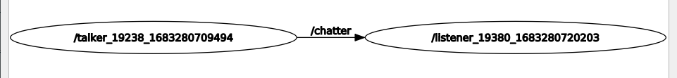
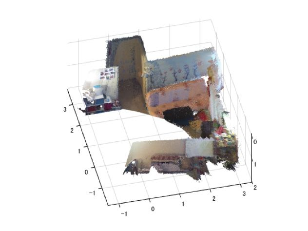
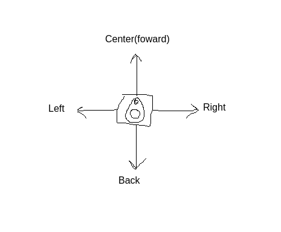
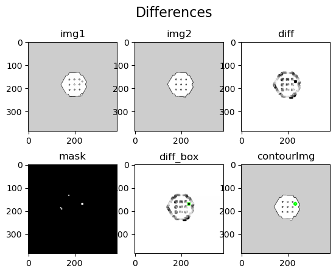
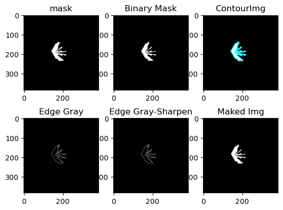
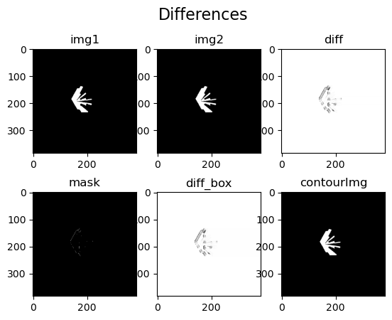
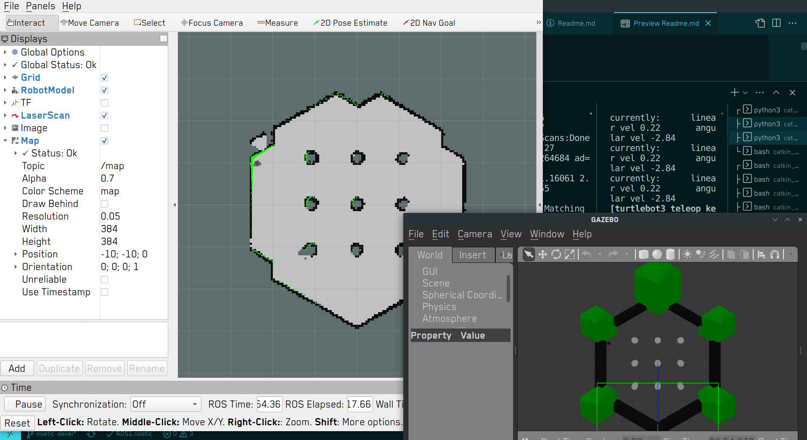
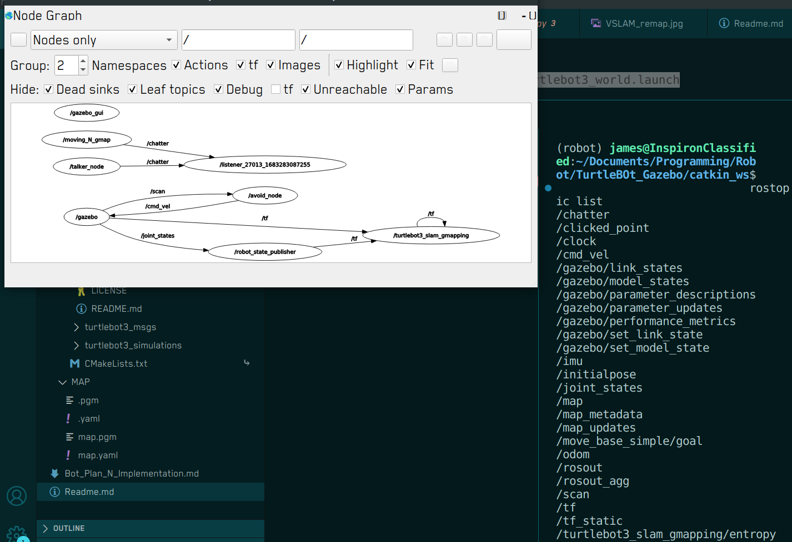

- Overall
  - About ROS: set of software libraries and tools that help to build robot applications
  - topic - node
    in Ros, a process called node, for a robot to do a particular task, there usually are
    multiple nodes run at the same time. These node communicate with each other through "topic"
    example:
      
- Goal
  robot that is smart enough to detect if there's anything out of the ordinary in the house (in case nobody's home and don't have pets) and dumb enough for me to implement.
  In order to do that, there're 2 fundamentals that the bot's required to perform:

  - Movement: tend to use motor and SLAM (it allows us build a map and localize our robot in that map at the same time.)
  - Detection system
    SLAM, camera (face detection/computer vision...)

  * Approaches
    Manipulate 2 things: Motor & Lidar Sensor (Light detection and ranging) 

    - People's approach
      Visual SLAM (use camera): extract features between cam's frame, then create a map and
      put itself in that mask in relative position, this allows to:

      - resconstruct 3d point cloud environment
        
      - draw a map and locate itself in said map 
          

    - My Approach
      Motor and use Lidar for everything else

      - Movement:
        Move randomly with Lidar for detecting obstacle

        - in detail: lidar shoot laser 360', that information is published in the /scan topic
          the avoiding script read that laserScan info from /scan, and see if there's any obstacle, if meet a wall for eg, the bot then looks for nearest part close to it's foward direction and steer itself toward that direction. 
            

      - Detection: Image Process-based 
        - First version
            
          have 2 map: og and tmp, compare the tmp with the og, if there're any difference, send warning
          - Draw the first map intentionally via tele operation (teleop)
          - Then let the bot strolling around, when it finishs it's routes, check the 2 maps
            - problems:
              At the current state, this process requires the robot to complete the whole route before the checking-step takes place. This however is a very problematic way to do things. For example if an intruder broke into the house in which the robot guards, by the time the robot finishes the routes and send alert to the user, the burglar may have been long gone.
        - Current version:
          Set interval and compare only the currently scanned region with that region of ogImage.  
              
              
        - Improve:
              
          Currently doing all of these tasks require large amount of terminals te be opened at the same time. Now with creating launch file and rebuild the package, it require only one terminal to do the task.
          Total nodes run:
              

- Achived
  A robot with the ability to detect anomaly and navigate autonomously
  - Development & Improvment
    - Compare to mine
    - Compare to other's
- Obstacle
- FuturePlan
  -
