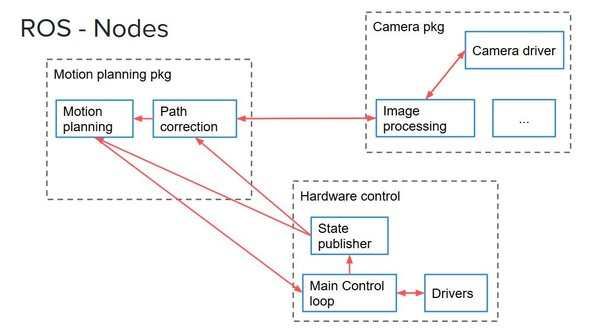

# Installation and setup (for each run)

## quick start

```
#Quick Start
-PI
	username: ubuntu
	password: turtlebot
	connect to your SSID:
		sudo nano /etc/netplan/50-cloud-init.yaml
		<-change the SSID and the PW in quotation marks->
		sudo netplan apply
	get your Pi's IP: ifconfig, inet under wl
	Set IP
		export ROS_MASTER_URI=http://{IP_ADDRESS_OF_REMOTE_PC}:11311
		export ROS_HOSTNAME={IP_ADDRESS_OF_RASPBERRY_PI_3}
		source ~/.bashrc

-PC
	get your ip
	Set IP
		export ROS_MASTER_URI=http://{IP_ADDRESS_OF_REMOTE_PC}:11311
		export ROS_HOSTNAME={IP_ADDRESS_OF_REMOTE_PC}
		source ~/.bashrc
	activate your env, roscore
	connect to your bot
		ssh ubuntu@"BotIP" || Eg: ssh ubuntu@192.168.1.12
	bringup, do your things|| eg: `roslaunch turtlebot3_gazebo turtlebot3_world.launch `
```

## quick setup=========================================================================================:

```cpp
conda activate robot
source /opt/ros/noetic/setup.bash
export WEBOTS_HOME=/usr/local/webots
// go to TurtleBOt_Gazebo/catkin_ws/src directory
cd ~/Documents/Programming/Robot/TurtleBOt_Gazebo/catkin_ws
export TURTLEBOT3_MODEL=burger
export PROJ=/home/james/Documents/Programming/Robot/
source devel/setup.bash
clear
```

```py

echo 'export TURTLEBOT3_MODEL=${burger}' >> ~/.bashrc
echo 'export LDS_MODEL=LDS-01' >> ~/.bashrc
roslaunch turtlebot3_slam turtlebot3_slam.launch slam_methods:=gmapping
on the PC, configure ROS destination to connect to the PC: why ? idk </br>
MASTER_URI: PC
HOSTNAME: RaspI IP

```

put it to bash(To add the workspace to your ROS environment you need to source the generated setup file):
source `devel/setup.bash`

## `What I'm doing`

```cpp
roscore
//run simulation
roslaunch turtlebot3_gazebo turtlebot3_world.launch
    //run autonavigation
    /home/james/Documents/Programming/Robot/customNode/src/DetectAnomaly.py
    rosrun turtlebot3_example scripts/laser_obstacle_avoid_360_node_class.py
    rosrun turtlebot3_example scripts/DetectAnomaly.py
    //draww map
    roslaunch turtlebot3_slam turtlebot3_slam.launch slam_methods:=gmapping
    //save map
    rosrun map_server map_saver -f $PROJ/customNode/res/map
    rosrun map_server map_saver -f $PROJ/TurtleBOt_Gazebo/catkin_ws/src/my_nodes/res/map_tmp.pgm
//run navigation
roslaunch turtlebot3_navigation turtlebot3_navigation.launch map_file:=$PROJ/customNode/res/map.yaml
//show graph
```

## Creating Package

- [What does devel folder do ?](https://shorturl.at/kwKZ7) :<br>
  For normal development though, I'd always just use the devel space (name sort of implies that). The install space is typically an 'end-station': you use it for deployment.

- Now I need to create a pair of talker (publisher) and listener (subscriber). <br>
  --> Each node need to be a catkin package,<br>
  Why use catkin ? (it lets CMake work for each individual as project, this help
  modular I think) <br>
  hence these are required:
  - CmakeList.txt to use catkin
  - meta file for information: .xml

```py
cd ~/catkin_ws/src
# This is an example, do not try to run this
# catkin_create_pkg <package_name> [depend1] [depend2] [depend3]
catkin_create_pkg beginner_tutorials std_msgs rospy roscpp
# Then go back to catkin_ws, build, then ./devel/setup.bash
## See dependencies
rospack depends beginner_tutorials # all
rospack depends1 beginner_tutorials # first layer dependencies

```

## WEBOTS <--abandoned--> set up env for webots_ros each time open terminal:

```
conda activate robot
source /opt/ros/noetic/setup.bash
export WEBOTS_HOME=/usr/local/webots
```

ros was built with python3.8 in mind, so using another release may causes issues in later run. One can install many python3 version, to choose which one to use, use:</br>
-edit `bashrc`:

```
add this line to the file:
alias python3=python3.8
alias python=python3.8
```

then `source ~/.bashrc`, Done!
rosrun map_server map_saver -f /home/james/Documents/Programming/Robot/customNode/res/map

Activate the relevant environment, then install your target python version.

conda activate my_env
conda install python=3.6

type -a python
But that somehow still does not work, but
run pm;u

```
 rqt_graph
```

works somehow.

## activate env:

starts a ROS Master, a ROS Parameter Server and a rosout logging node which are the pre-requisites of a ROS system. Every other node can only run in the system if the roscore is running and reachable.

```
roscore
```

## check env:

```
printenv | grep ROS
```

### rosnode to see what running roscore did

rosnode displays information about the ROS nodes that are currently running

#### list active nodes:

```
rosnode list
```

#### returns information about a specific node

```
rosnode info /rosout
```

# open some demos baby:

```
roslaunch webots_ros keyboard_teleop.launch
roslaunch turtlebot3_teleop turtlebot3_teleop_key.launch

rosrun turtlesim turtlesim_node // another sim but on ROS itself
```

runs a node from a given package.
create ROS workspace:

```py
 mkdir -p ~/catkin_ws/src || or mkdir -p ./catkin_ws/src
 cd ~/catkin_ws/
 catkin_make
 #or
 catkin build -DPYTHON_EXECUTABLE=/usr/bin/python3 -DPYTHON_INCLUDE_DIR=/usr/include/python3.8
 #if the catkin_make doesnt work
```

source your new setup.\*sh file:

```
source devel/setup.bash
```

# to kill Roscore process

```
killall -9 roscore
killall -9 rosmaster
```

# SAMPLE 2 TELEOP_KEY

tele-operation key event, ROS run by a bunch of nodes talking to each other, this group of nodes called a package, a deeper dive to this topic will be mentioned later.
first run `roscore` like normal, making these nodes:

- turtlesim `rosrun turtlesim turtlesim_node `
- teleop_key `rosrun turtlesim turtle_teleop_key`
  In these command above, command is in the format: </br>
  `rosrun` `topic` `nodes` </br>
  to see all the nodes of said topic, use

```
 rosrun package_name <tab><tab>
```

# Topic

Ros Nodes communicate with each other through `topic`
in this example:
"turtle_teleop_key" is publishing the key strokes on a topic, while "turtlesim" subscribes to the same topic to receive the key strokes.
use `rostopic` to get the topic information of ros nodes.

### visualise nodes's relationship:

rqt_graph creates a dynamic graph of what's going on in the system. rqt_graph is part of the rqt package. Unless you already have it installed, run:

```
sudo apt-get install ros-<distro>-rqt
sudo apt-get install ros-<distro>-rqt-common-plugins
```

in this case, it is:

```
sudo apt-get install ros-noetic-rqt
sudo apt-get install ros-noetic-rqt-common-plugins
```

use these packages:

```
rosrun rqt_graph rqt_graph
or
python3.8 /opt/ros/noetic/lib/rqt_tf_tree/rqt_tf_tree
```

#### `install custom package`

in this case is a python package

- like th this package (it has a little guide in the end): https://github.com/Rad-hi/Obstacle-Avoidance-ROS </br>
  The node need to be placed inside a package before running it, so copy the node file into any existing package you have, or create its own package for it. Once you have the file in your machine, you'll need to run the TurtleBot sumulation (you can run this code with any robot that's using the Twist message under the /cmd_vel topic, just make sure you adjust the obstacle threshhold along with the other key parameters), then you can launch the code and watch your robot dodge all obstacles around it.
  for example:

```
1- Place the project inside: catkin_ws/src/turtlebot3/turtlebot3_example/PLACE_SCRIPTS_FOLDER_HERE

2- Run $ roscore

3- (On a seperate terminal) Run $ roslaunch turtlebot3_gazebo turtlebot3_world.launch Assuming you have turtlebot3 already setup on your pc*

4- (On a seperate terminal) Run $ rosrun turtlebot3_example scripts/laser_obstacle_avoid_360_node_class.py
```

then run via:

```
rosrun turtlebot3_example scripts/laser_obstacle_avoid_360_node_class.py
```

if the OS can't find the executable for some reason, run
`sudo chmod +x talker.py` </br>
what did that line do ? </br>
`chmod`: in a sense it allow the script to be executable, why do we need to do that in the first place, Idk yet, let not dive to deep into it rn.

### Fancy pant plots:

```
rqt_plot

```

## Edit and Interact with node & topics:

`rostopic pub` publishes data on to a topic currently advertised.

```
rostopic pub [topic] [msg_type] [args]
```

`eg:`

```
rostopic pub -1 /turtle1/cmd_vel geometry_msgs/Twist -- '[2.0, 0.0, 0.0]' '[0.0, 0.0, 1.8]'
rostopic pub /turtle1/cmd_vel geometry_msgs/Twist -r 1 -- '[2.0, 0.0, 0.0]' '[0.0, 0.0, -1.8]'
```

# FUNDAMENTAL

## Nodes & Packages

</br>
example: 3 package with it's nodes as instruction, The blue boxes are nodes, and the red arrow show the communication between the nodes.
